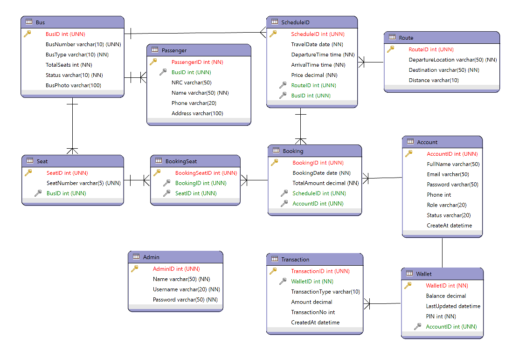

# Bus Ticket Booking System (BTBS) 🚌🎫


An end-to-end database design, UML modeling, and Java backend project for a **Bus Ticket Booking & Reservation System (BTBS)**. Designed for semester coursework (2025–2026), this project models the real-world operational workflows of intercity bus ticketing, automated seat selection, and digital wallet payment transactions.

---

## 📌 Project Overview

The **Bus Ticket Booking System (BTBS)** provides a centralized platform connecting passengers with bus operators. It streamlines route scheduling, seat reservation, ticket issuance, and digital payments through an integrated customer wallet system.

### Key Features
- **Route & Fleet Management**: Define intercity bus routes (origin, destination, distance) and manage vehicle types (`VIP 2+1`, `Standard 2+2`).
- **Dynamic Scheduling**: Configurable departure/arrival schedules, pricing, and bus assignments.
- **Interactive Seat Selection**: Bus-specific seat maps preventing double-booking.
- **In-App Digital Wallet**: PIN-protected digital wallet with balance checks, deposit tracking, and booking payments.
- **Transaction Ledger**: Complete audit log of all financial transactions (`Deposit`, `Payment`, `Refund`).
- **Administrative Control**: User accounts, passenger manifests, and reporting.

---

## 📐 System Architecture & UML Diagrams

### 1. Use Case Diagram
Describes the interactions between key system actors (**Passenger** and **Admin**) and system functionalities.

<p align="center">
  
</p>

---

### 2. Activity Diagram
Visualizes the customer booking lifecycle: route search &rarr; seat selection &rarr; wallet verification &rarr; PIN authentication &rarr; booking confirmation.

<p align="center">
  
</p>

---

### 3. Sequence Diagram
Details step-by-step method calls and data flow between the Passenger, UI, Backend Services, and Database.

<p align="center">
  
</p>

---

### 4. Entity-Relationship Diagram (ERD)
The relational schema generated with ERMaster, showing all 11 tables and their relational integrity constraints.

<p align="center">
  
</p>

---

## 🗄️ Database Schema & Data Dictionary

The relational database is normalized and configured in [`BTBS(ERD).sql`](BTBS(ERD).sql) for MySQL 8.0+.

| Table Name | Primary Key | Description | Key Relationships |
| :--- | :--- | :--- | :--- |
| **`Account`** | `AccountID` | Registered user credentials and profile | 1:1 with `Wallet`, 1:N with `Booking` |
| **`Admin`** | `AdminID` | Administrator credentials for backend management | Independent |
| **`Wallet`** | `WalletID` | Digital wallet balance and security PIN | 1:1 with `Account`, 1:N with `Transaction` |
| **`Transaction`** | `TransactionID` | Deposit and payment audit logs | N:1 with `Wallet` |
| **`Route`** | `RouteID` | City pairs and distance | 1:N with `ScheduleID` |
| **`Bus`** | `BusID` | Fleet vehicles, seating capacity, and status | 1:N with `Seat`, 1:N with `ScheduleID` |
| **`Seat`** | `SeatID` | Physical seat numbers per bus (`A1`, `A2`, etc.) | N:1 with `Bus`, 1:N with `BookingSeat` |
| **`ScheduleID`**| `ScheduleID` | Scheduled trips with date, times, price, bus & route | N:1 with `Route`, N:1 with `Bus`, 1:N with `Booking` |
| **`Booking`** | `BookingID` | Master booking ticket record and payment total | N:1 with `ScheduleID`, N:1 with `Account`, 1:N with `BookingSeat` |
| **`BookingSeat`**| `BookingSeatID`| Junction table linking booked seats to bookings | N:1 with `Booking`, N:1 with `Seat` |
| **`Passenger`** | `PassengerID` | Passenger identification details (NRC, Name, Phone) | N:1 with `Bus` |

---

## 📂 Project Structure

```plaintext
BusTicketBookingSystem2025_26/
├── .classpath                          # Eclipse project classpath configuration
├── .gitignore                          # Git ignore rules for build artifacts
├── .project                            # Eclipse project definition
├── README.md                           # Repository documentation
├── BTBS(ERD).sql                       # MySQL DDL & Seed Data script
├── BTBS(ERD).erm                       # ERMaster diagram source file
├── BTBS(ERD).png                       # Entity-Relationship diagram export
├── BTBS(use case)new.png               # UML Use Case diagram
├── BTBS(activity diagram).png          # UML Activity diagram
├── BTBS(sequence diagram).png          # UML Sequence diagram
├── lib/
│   └── mysql-connector-j-9.6.0.jar     # MySQL JDBC Driver
└── src/
    ├── module-info.java                # Java 9+ module descriptor (requires java.sql)
    └── com/
        └── btbs/
            ├── Main.java               # Runnable console demo application
            ├── model/                  # POJO model classes (generated & refined)
            │   ├── Account.java
            │   ├── Admin.java
            │   ├── Booking.java
            │   ├── Bookingseat.java
            │   ├── Bus.java
            │   ├── Passenger.java
            │   ├── Route.java
            │   ├── Scheduleid.java
            │   ├── Seat.java
            │   ├── Transaction.java
            │   └── Wallet.java
            └── util/
                └── DBConnection.java   # JDBC connection manager
```

---

## 🚀 Getting Started

### Prerequisites
- **Java JDK 21+** (or Java 17+)
- **MySQL Server 8.0+**
- **Eclipse IDE for Java Developers** (optional, CLI also supported)

---

### 1. Database Setup

1. Open your MySQL terminal or GUI (MySQL Workbench, phpMyAdmin, DBeaver).
2. Execute [`BTBS(ERD).sql`](BTBS(ERD).sql) to create the database, tables, foreign keys, and seed data:

```bash
mysql -u root -p -e "CREATE DATABASE IF NOT EXISTS btbs; USE btbs; source BTBS(ERD).sql;"
```

3. Update database credentials in [`src/com/btbs/util/DBConnection.java`](src/com/btbs/util/DBConnection.java) if your MySQL password is not blank:
```java
private static final String URL = "jdbc:mysql://localhost:3306/btbs?useSSL=false&allowPublicKeyRetrieval=true&serverTimezone=UTC";
private static final String USER = "root";
private static final String PASSWORD = "your_password";
```

---

### 2. Running in Eclipse IDE

1. Open **Eclipse IDE**.
2. Go to **File** &rarr; **Import...** &rarr; **General** &rarr; **Existing Projects into Workspace**.
3. Select this repository folder as the root directory and click **Finish**.
4. Right-click on [`src/com/btbs/Main.java`](src/com/btbs/Main.java) &rarr; **Run As** &rarr; **Java Application**.

---

### 3. Running via Command Line

#### Compile:
```powershell
javac -d bin -cp "lib/mysql-connector-j-9.6.0.jar" (Get-ChildItem -Path src -Recurse -Filter *.java | Select-Object -ExpandProperty FullName)
```

#### Run Demo:
```powershell
java -cp "bin;lib/mysql-connector-j-9.6.0.jar" com.btbs.Main
```

---

## 🧪 Console Demo Preview

When running `com.btbs.Main`, the application connects to the database and outputs:

```text
===============================================================================
             BUS TICKET BOOKING SYSTEM (BTBS) - 2025/2026                      
===============================================================================

[1/4] Checking MySQL Database Connection... CONNECTED (OK)

-------------------------------------------------------------------------------
 AVAILABLE ROUTES
-------------------------------------------------------------------------------
RouteID  | From               | To                 | Distance  
---------+--------------------+--------------------+-----------
1        | Yangon             | Mandalay           | 630 km    
2        | Yangon             | Naypyitaw          | 380 km    
3        | Yangon             | Bagan              | 620 km    
4        | Mandalay           | Yangon             | 630 km    

-------------------------------------------------------------------------------
 ACTIVE TRAVEL SCHEDULES
-------------------------------------------------------------------------------
ID   | Route              | Date       | Dep.     | Arr.     | Price (MMK)  | Bus No.      | Type        
-----+--------------------+------------+----------+----------+--------------+--------------+-------------
1    | Yangon -> Mandalay | 2026-10-01 | 08:00:00 | 17:00:00 |    25,000.00 | YGN-7A1234   | VIP (2+1)   
2    | Yangon -> Mandalay | 2026-10-01 | 20:00:00 | 05:00:00 |    25,000.00 | YGN-7A1234   | VIP (2+1)   
3    | Yangon -> Naypyitaw| 2026-10-02 | 09:00:00 | 15:00:00 |    18,000.00 | YGN-5B5678   | Standard (2+2)
4    | Yangon -> Bagan    | 2026-10-03 | 19:30:00 | 06:30:00 |    28,000.00 | YGN-7A1234   | VIP (2+1)   

-------------------------------------------------------------------------------
 SEAT AVAILABILITY & LAYOUT (Schedule #1)
-------------------------------------------------------------------------------
[X] A1    [X] A2    [O] A3    [O] B1    [O] B2    
[O] B3    [O] C1    [O] C2    [O] C3    [O] D1    
[O] D2    [O] D3    [O] E1    [O] E2    [O] E3    

Legend: [O] Available | [X] Booked

-------------------------------------------------------------------------------
 SAMPLE BOOKING CONFIRMATION DETAILS (Booking #1)
-------------------------------------------------------------------------------
 Booking ID    : #1
 Passenger     : Aung Aung (aungaung@gmail.com)
 Route         : Yangon -> Mandalay
 Departure     : 2026-10-01 at 08:00:00
 Bus Assigned  : YGN-7A1234
 Seats Booked  : A1, A2
 Total Paid    : 50,000.00 MMK (via Wallet)
===============================================================================
```

---

## 📋 Default Seed Credentials

For testing and demonstration:

| Role | Username / Email | Password | PIN | Balance |
| :--- | :--- | :--- | :--- | :--- |
| **Admin** | `admin` | `admin123` | - | - |
| **Passenger 1** | `aungaung@gmail.com` | `aung1234` | `1234` | 100,000.00 MMK |
| **Passenger 2** | `susu@gmail.com` | `susu5678` | `5678` | 50,000.00 MMK |

---

## 🎓 Academic Credit

- **Project**: Bus Ticket Booking System (BTBS)
- **Academic Year**: 2025 – 2026
- **Focus Areas**: Database Design, ER Modeling, UML Specification, JDBC Integration
